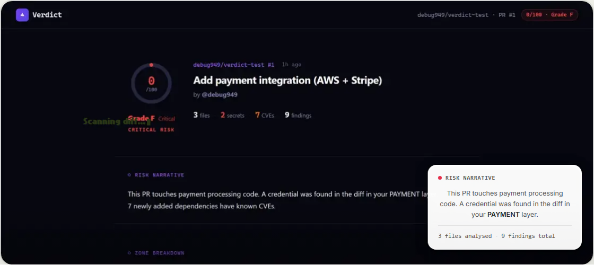
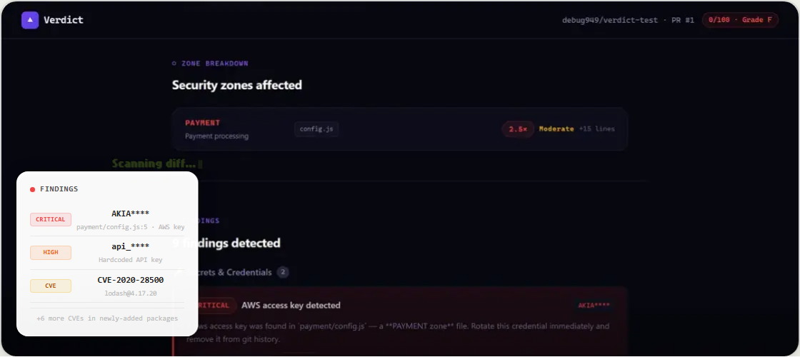
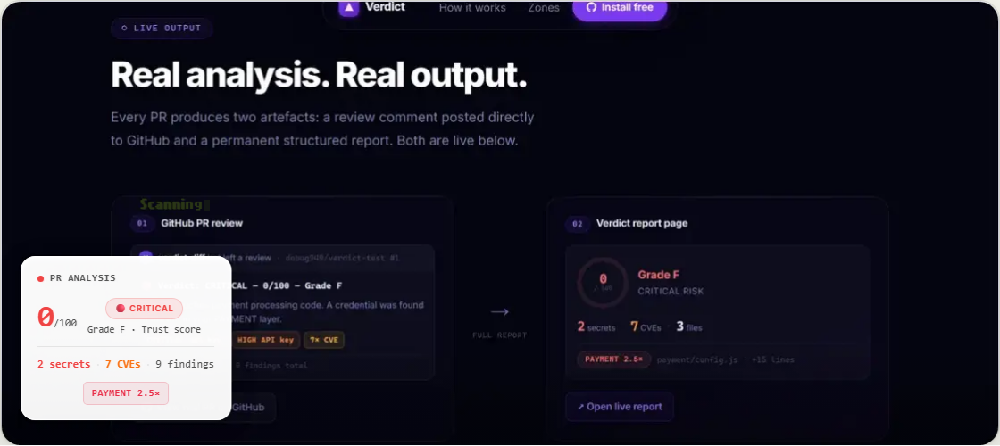

# Verdict — PR Risk Engine

> Know what you're merging. Before you merge it.

A **GitHub App** that runs a deterministic security pipeline on every pull request and posts a trust score — 0–100, grade A–F — directly to the PR. Not AI. Every finding is traceable to a specific line in the diff. Every score is reproducible.

**Live:** [verdict-vihan.vercel.app](https://verdict-vihan.vercel.app) &nbsp;·&nbsp; **Test report:** [debug949/verdict-test #1](https://verdict-vihan.vercel.app/r/debug949/verdict-test/1) &nbsp;·&nbsp; **Install:** [github.com/apps/verdict-diff](https://github.com/apps/verdict-diff)

<p>
  
  
  
  
  
  
  
</p>

<picture>
  <source media="(prefers-color-scheme: dark)" srcset="./public/screenshots/report-dark.png">
  
</picture>

---

## What it does

Three orthogonal signals combine into a single trust score:

| Signal | Mechanism | Coverage |
|--------|-----------|---------|
| **Secret scanning** | Regex over added lines only | AWS keys, GitHub PATs, Stripe secrets, OpenAI keys, DB URLs, generic API keys |
| **Dependency CVEs** | OSV.dev batch query for newly-added npm packages | Zero API calls for unchanged deps |
| **Zone-weighted risk** | Each changed file is classified into a security zone with a score multiplier | AUTH/PAYMENT (2.5×) → TEST (0.3×) |

A credential in `payment/checkout.ts` (**PAYMENT 2.5×**) penalises the score 2.5× harder than the same credential in `__tests__/fixtures.ts` (**TEST 0.3×**). Same finding, different risk — because context changes risk.

---

## How it works

```
PR opened / synchronised
       │
       ▼
Webhook  POST /api/webhooks/github
       │   → 200 returned immediately (GitHub delivery never times out)
       │
       ▼   (next/server after() — runs after response is sent)
Pipeline
├── fetchPRFiles        GitHub API — changed files + unified diffs
├── classifyFiles       Path → SecurityZone (8 zones, priority-ordered rules)
├── scanSecrets         Regex credential detection — added lines only
├── auditDependencies   OSV.dev batch CVE lookup for new npm packages
├── calculateTrustScore Zone-weighted score with diminishing returns
├── postVerdictReview   GitHub PR review + inline comment on each flagged line
├── postCheckRun        GitHub check run (pass/fail in PR status bar)
└── saveReport          Persist StoredReport to Upstash Redis (30-day TTL)
```

The webhook handler returns 200 immediately, then the full pipeline runs via `after()`. GitHub's 10-second delivery timeout is never a concern regardless of PR size.

---

## Security zones

Every changed file is classified by path. No AST parsing, no heuristics — deterministic path matching only.

| Zone | Multiplier | Path patterns |
|------|-----------|--------------|
| AUTH | **2.5×** | `auth/`, `session/`, `jwt/`, `oauth/`, `middleware/`, `guard/` |
| PAYMENT | **2.5×** | `payment/`, `billing/`, `checkout/`, `stripe/`, `invoice/` |
| ADMIN | **2.0×** | `admin/`, `management/`, `backoffice/` |
| API | **1.5×** | `app/api/`, `pages/api/`, `routes/`, `controllers/` |
| DATA | **1.5×** | `models/`, `prisma/`, `db/`, `migrations/` |
| CONFIG | **1.3×** | `.env*`, `config/`, `settings/`, `*.config.*` |
| GENERAL | **1.0×** | Everything else |
| TEST | **0.3×** | `*.test.*`, `*.spec.*`, `__tests__/`, `fixtures/` |

---

## Report page

Every analysis is persisted to Upstash Redis and viewable at:

```
https://verdict-vihan.vercel.app/r/<owner>/<repo>/<pr-number>
```

The report shows the trust score ring, risk narrative, zone breakdown, all findings with file and line references, and per-file impact stats. Server-rendered from the stored `StoredReport` — no client-side fetching.

<picture>
  <source media="(prefers-color-scheme: dark)" srcset="./public/screenshots/findings-dark.png">
  
</picture>

Reports expire after 30 days. Missing reports show a graceful not-found state.

---

## Real output

The test PR [`debug949/verdict-test #1`](https://github.com/debug949/verdict-test/pull/1) contains deliberately bad code:

- `payment/config.js` — hardcoded AWS access key (`AKIA****`) and API key (`api_****`)
- `package.json` — adds `lodash@4.17.20` (5 CVEs) and `express@4.18.2` (2 CVEs)

**Result:** Score **0/100** · Grade **F** · **CRITICAL** · 2 secrets · 7 CVEs · 9 findings total

The PAYMENT zone multiplier (2.5×) applied to both secrets drives the score to zero. [View the live report →](https://verdict-vihan.vercel.app/r/debug949/verdict-test/1)

---

## Landing page

<picture>
  <source media="(prefers-color-scheme: dark)" srcset="./public/screenshots/showcase-dark.png">
  
</picture>

---

## What this demonstrates

- **GitHub App engineering** — RS256 JWT → installation token exchange, HMAC-SHA256 webhook verification (timing-safe), structured PR review + inline comments + check run in a single analysis pass.
- **Async pipeline design** — `next/server after()` decouples webhook acknowledgement from analysis. GitHub sees a 200 in <50ms. The full pipeline runs independently.
- **Deterministic analysis** — regex secret scanning, OSV.dev CVE lookup, and zone classification are all side-effect-free and reproducible. Given the same diff, the score is always identical.
- **Failure isolation** — `saveReport()` returns `boolean` and never throws. `loadReport()` returns `null` on failure. A Redis outage never affects PR reviews or check runs.
- **Schema versioning** — `StoredReport` carries `schemaVersion: 1`. Stale reports from old deploys show a not-found page rather than deserialising into the wrong shape.
- **Production deployment** — live GitHub App processing real PRs, Vercel + Upstash Redis, full environment management.

---

## Resume bullet

> **Verdict — GitHub App PR Risk Engine.** Built and deployed a deterministic security analysis pipeline (Next.js, TypeScript, GitHub Apps API, Upstash Redis) that runs on every pull request: credential detection via regex over added lines, CVE lookup via OSV.dev for newly-added dependencies, and zone-weighted scoring where the same finding carries different weight depending on which security layer the changed file belongs to. Engineered for production: HMAC-SHA256 webhook verification, async pipeline via `after()` (webhook never times out), schema-versioned report persistence, and fully isolated failure domains.

---

## Setup

### 1. Create a GitHub App

1. **GitHub → Settings → Developer settings → GitHub Apps → New GitHub App**
2. Set:
   - **Homepage URL**: your deployment URL
   - **Webhook URL**: `https://<your-domain>/api/webhooks/github`
   - **Webhook secret**: `node -e "console.log(require('crypto').randomBytes(32).toString('hex'))"`
3. **Repository permissions**: Pull requests → Read & write · Checks → Read & write · Contents → Read
4. **Subscribe to events**: Pull request · Installation · Installation repositories
5. **Create GitHub App**

### 2. Generate a private key

App settings → **Private keys** → **Generate a private key**. Encode:

```bash
base64 -i your-app.private-key.pem | tr -d '\n'
```

### 3. Provision Upstash Redis

[console.upstash.com](https://console.upstash.com) → **Create Database** (Regional, free tier). Copy `UPSTASH_REDIS_REST_URL` and `UPSTASH_REDIS_REST_TOKEN`.

### 4. Configure environment variables

```bash
cp .env.example .env.local
```

```env
GITHUB_APP_ID=              # numeric ID from app settings page
GITHUB_APP_PRIVATE_KEY=     # base64-encoded PEM from step 2
GITHUB_WEBHOOK_SECRET=      # secret from step 1
NEXT_PUBLIC_APP_URL=        # https://your-domain (no trailing slash)
UPSTASH_REDIS_REST_URL=     # https://your-db.upstash.io
UPSTASH_REDIS_REST_TOKEN=   # token from Upstash dashboard
```

> **Vercel note:** Do not set `GITHUB_APP_PRIVATE_KEY` via `echo "..." | vercel env add` in PowerShell — PowerShell 5.1 prepends a UTF-8 BOM that corrupts the value. Use `vercel env add` interactively or the Vercel dashboard.

### 5. Deploy

```bash
npm i -g vercel
vercel --prod
```

> Vercel Pro is recommended for the full `maxDuration` window on `after()`. On Hobby, functions may be killed before the pipeline completes on larger PRs.

### 6. Install the GitHub App

**GitHub → Settings → Developer settings → GitHub Apps → [your app] → Install App** → choose repos.

### 7. Open a PR

Push to a watched repo. Within seconds:
- A **Verdict review comment** appears on the PR
- A **Verdict check run** appears in the PR status bar
- A **full report** is available at `https://your-domain/r/<owner>/<repo>/<pr-number>`

---

## Local development

```bash
npm install
npm run dev
```

To receive GitHub webhooks locally:

```bash
npx smee-client --url https://smee.io/<channel> --target http://localhost:3000/api/webhooks/github
```

---

## Project structure

```
src/
├── app/
│   ├── api/webhooks/github/route.ts        Webhook handler — HMAC verify, event dispatch
│   ├── r/[owner]/[repo]/[prNumber]/
│   │   ├── page.tsx                         Report page (server component)
│   │   └── not-found.tsx                    Graceful not-found state
│   ├── layout.tsx
│   └── page.tsx                             Landing page
│
└── lib/
    ├── github/
    │   ├── app.ts          RS256 JWT → installation access token exchange
    │   ├── comment.ts      Post PR review + inline comments + check run
    │   ├── diff.ts         Fetch PR files, parse unified diff, extract added lines
    │   └── webhook.ts      HMAC-SHA256 signature verification (timing-safe)
    ├── analysis/
    │   ├── zone-classifier.ts   File path → SecurityZone (8 zones, priority-ordered)
    │   ├── secret-scanner.ts    Regex credential detection over added lines
    │   └── dep-auditor.ts       OSV.dev batch CVE lookup for new npm packages
    ├── risk/
    │   └── scorer.ts            Zone-weighted trust score + blast radius estimation
    ├── store/
    │   └── report.ts            saveReport() / loadReport() — Upstash Redis abstraction
    ├── verdict/
    │   ├── comment.ts           Format PR review markdown + inline finding comments
    │   └── types.ts             Shared TypeScript types (StoredReport, Finding, …)
    └── pipeline.ts              Orchestrate full analysis — Phases 1–5
```

---

## Architecture notes

**Failure isolation.** `saveReport()` returns `boolean` (never throws). `loadReport()` returns `StoredReport | null` (never throws). A KV failure never breaks PR reviews or check runs — those complete before persistence runs.

**Schema versioning.** `StoredReport` carries `schemaVersion: 1`. `loadReport()` returns `null` if the version doesn't match, so stale reports from old deploys show a not-found page rather than crashing.

**Zone classification.** All patterns require a normalised path (leading `/` prepended) so `payment/config.js` at repo root classifies as PAYMENT, not GENERAL.

**Secret scanning scope.** Only added lines (`+` in the diff) are scanned. Unchanged secrets already in the codebase are not re-reported on every PR.

---

## Environment variables

| Variable | Required | Description |
|----------|----------|-------------|
| `GITHUB_APP_ID` | Yes | Numeric GitHub App ID |
| `GITHUB_APP_PRIVATE_KEY` | Yes | Base64-encoded RSA private key PEM |
| `GITHUB_WEBHOOK_SECRET` | Yes | HMAC-SHA256 webhook secret |
| `NEXT_PUBLIC_APP_URL` | Yes | Public deployment URL — no trailing slash |
| `UPSTASH_REDIS_REST_URL` | Recommended | Upstash Redis REST URL — reports degrade gracefully without it |
| `UPSTASH_REDIS_REST_TOKEN` | Recommended | Upstash Redis REST token |

---

<sub>Built by [@debug949](https://github.com/debug949). MIT licensed.</sub>
